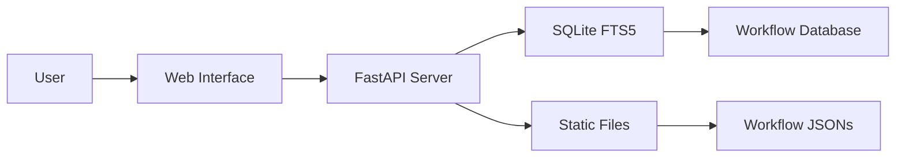

# n8n Workflow Collection

<div align="center">


[](https://www.buymeacoffee.com/zie619)

### n8n 自动化工作流终极合集

**[在线浏览](https://zie619.github.io/n8n-workflows)** · **[文档](#documentation)** · **[贡献](#contributing)** · **[许可证](#license)**

</div>

## 最新动态

### 最新更新 (2025年11月)
- **增强安全性**: 完成全面安全审计，解决所有 CVE
- **Docker 支持**: 支持 linux/amd64 和 linux/arm64 的多平台构建
- **GitHub Pages**: 带有实时搜索功能的在线界面，访问 [zie619.github.io/n8n-workflows](https://zie619.github.io/n8n-workflows)
- **性能**: 借助 SQLite FTS5，搜索速度提升 100 倍
- **现代 UI**: 全新设计的界面，支持深色/浅色模式

---

## 快速访问

### 在线使用 (无需安装)
访问 **[zie619.github.io/n8n-workflows](https://zie619.github.io/n8n-workflows)** 即可立即获得：
- **智能搜索** — 快速查找工作流
- **15+ 分类** — 按使用场景浏览
- **移动端适配** — 支持任何设备
- **直接下载** — 即刻获取工作流 JSON

---

## 特性

<table>
<tr>
<td width="50%">

### 核心数据
- **4,343** 个生产级工作流
- **365** 个独特的集成
- **29,445** 个总节点
- **15** 个条理清晰的分类
- **100%** 导入成功率

</td>
<td width="50%">

### 性能
- **< 100ms** 的搜索响应
- **< 50MB** 的内存占用
- 比 v1 **小 700倍**
- 加载速度 **快 10倍**
- RAM 使用量 **少 40倍**

</td>
</tr>
</table>

---

## 本地安装

### 环境要求
- Python 3.9+
- pip (Python 包管理器)
- 100MB 可用磁盘空间

### 快速开始
```bash
# 克隆仓库
git clone https://github.com/Zie619/n8n-workflows.git
cd n8n-workflows

# 安装依赖
pip install -r requirements.txt

# 启动服务器
python run.py

# 在浏览器中打开
# http://localhost:8000
```

### Docker 安装
```bash
# 使用 Docker Hub
docker run -p 8000:8000 zie619/n8n-workflows:latest

# 或者在本地构建
docker build -t n8n-workflows .
docker run -p 8000:8000 n8n-workflows
```

---

## 文档

### API 接口

| 接口 | 方法 | 描述 |
|----------|--------|-------------|
| `/` | GET | Web 界面 |
| `/api/search` | GET | 搜索工作流 |
| `/api/stats` | GET | 仓库统计信息 |
| `/api/workflow/{id}` | GET | 获取工作流 JSON |
| `/api/categories` | GET | 列出所有分类 |
| `/api/export` | GET | 导出工作流 |

### 搜索特性
- 支持跨名称、描述和节点的**全文搜索**
- **分类过滤** (市场营销、销售、DevOps 等)
- **复杂度过滤** (低、中、高)
- **触发器类型过滤** (Webhook、计划任务、手动等)
- **服务过滤** (365+ 个集成)

---

## 架构



### 技术栈
- **后端**: Python, FastAPI, SQLite 和 FTS5
- **前端**: 原生 JS, Tailwind CSS
- **数据库**: 带有全文搜索的 SQLite
- **部署**: Docker, GitHub Actions, GitHub Pages
- **安全性**: Trivy 扫描, CORS 保护, 输入验证

---

## 仓库结构

```
n8n-workflows/
├── workflows/           # 4,343 工作流 JSON 文件
│   └── [category]/     # 按集成整理
├── docs/               # GitHub Pages 站点
├── src/                # Python 源代码
├── scripts/            # 实用脚本
├── api_server.py       # FastAPI 应用
├── run.py              # 服务器启动器
├── workflow_db.py      # 数据库管理器
└── requirements.txt    # Python 依赖
```

---

## 贡献

我们非常欢迎贡献！以下是您可以提供帮助的方式：

### 贡献方式
- **报告错误** 通过 [Issues](https://github.com/Zie619/n8n-workflows/issues)
- **建议功能** 在 [Discussions](https://github.com/Zie619/n8n-workflows/discussions)
- **完善文档**
- **提交工作流修复**
- **给仓库点个星**

### 开发环境设置
```bash
# Fork 并克隆
git clone https://github.com/YOUR_USERNAME/n8n-workflows.git

# 创建分支
git checkout -b feature/amazing-feature

# 进行更改并测试
python run.py --debug

# 提交并推送
git add .
git commit -m "feat: add amazing feature"
git push origin feature/amazing-feature

# 开启 PR (Pull Request)
```

---

## 安全性

### 安全性 Features
- 路径遍历保护
- 输入验证与清理
- CORS 保护
- 速率限制
- Docker 安全加固
- 非 root 容器用户
- 定期安全扫描

### 报告安全问题
请通过以下链接向维护者报告安全漏洞： [Security Advisory](https://github.com/Zie619/n8n-workflows/security/advisories/new).

---

## 许可证

本项目在 MIT 许可下发布 - 详情请参阅 [LICENSE](LICENSE) 文件。

---

## 支持

如果您觉得这个项目有帮助，请考虑：

<div align="center">

[](https://www.buymeacoffee.com/zie619)
[](https://github.com/Zie619/n8n-workflows)

</div>

---

<div align="center">


</div>

---

<div align="center">

**在 GitHub 上给我们点个星 —— 这是我们前进的巨大动力！**

由以下作者用心制作： [Zie619](https://github.com/Zie619) 以及 [contributors](https://github.com/Zie619/n8n-workflows/graphs/contributors)

<br />

<a href="https://github.com/Trusera/ai-bom">
  
</a>

**[AI-BOM](https://github.com/Trusera/ai-bom)** — 发现隐藏在基础架构中的每个 AI 代理、模型和 API。
<br />
开源者： **[Trusera](https://trusera.dev)** — 保护 Agentic Service Mesh 的安全。

</div>
